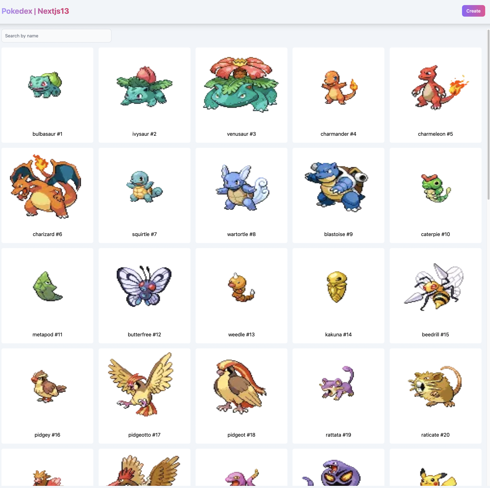

This is a [Next.js](https://nextjs.org/) project bootstrapped with [`create-next-app`](https://github.com/vercel/next.js/tree/canary/packages/create-next-app).

[Demo Link](https://pokedex.scentt.xyz/)

## Motivation

With the recent nextjs 13 and react RSC, i've decided to take this opportunity to build a simple Pokedex App that leverage this technology.

## Tool / Library used

- Next js v13
  - Known for SSR, SSG, ISR, with the new features it focus on letting developer build server side component first
  - SSR (server side render) - generate an html on server and server to the client side
  - SSG (static generation) - generate static html page
  - ISR (incremental static generation ) - allow to generate page on the basis of a timer.
- tanstack react-query
  - A great tool for handling asynchronous management tool without worrying about global state managment. It caches the result of a promise and store a serialize key/value pair in the browser storage.
- react-hook-form
  - a library that handle focus on performance - reduces the amount of re-render by using ref
  - handling of validation more efficiently
  - great dx experience
- zod
  - Zod is a TypeScript-first schema declaration and validation library. I'm using the term "schema" to broadly refer to any data type, from a simple string to a complex nested object.
- mongodb
  - for handling persistant data, i'am using mongodb database with nextjs api route for creating API's

## Key features

- Search Pokemons Pagination
- Pokemon Details Page
  - i've added the liberty of using nextjs getStaticParams to generate static page during build time. E.g `<base route>/pokemon/1` will return an html, this reduce the time to load the page significantly
- Create Pokemon

---

## Getting Started

First, run the development server:

```bash
npm run dev
# or
yarn dev
```

Open [http://localhost:3000](http://localhost:3000) with your browser to see the result.

You can start editing the page by modifying `pages/index.tsx`. The page auto-updates as you edit the file.

[API routes](https://nextjs.org/docs/api-routes/introduction) can be accessed on [http://localhost:3000/api/hello](http://localhost:3000/api/hello). This endpoint can be edited in `pages/api/pokemon/.ts`.

The `pages/api` directory is mapped to `/api/*`. Files in this directory are treated as [API routes](https://nextjs.org/docs/api-routes/introduction) instead of React pages.

## Learn More

To learn more about Next.js, take a look at the following resources:

- [Next.js Documentation](https://nextjs.org/docs) - learn about Next.js features and API.
- [Learn Next.js](https://nextjs.org/learn) - an interactive Next.js tutorial.

You can check out [the Next.js GitHub repository](https://github.com/vercel/next.js/) - your feedback and contributions are welcome!

## Deploy on Vercel

The easiest way to deploy your Next.js app is to use the [Vercel Platform](https://vercel.com/new?utm_medium=default-template&filter=next.js&utm_source=create-next-app&utm_campaign=create-next-app-readme) from the creators of Next.js.

Check out our [Next.js deployment documentation](https://nextjs.org/docs/deployment) for more details.
